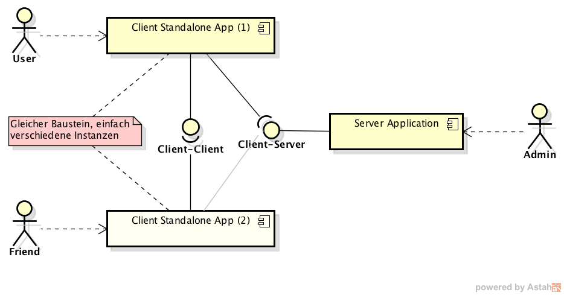
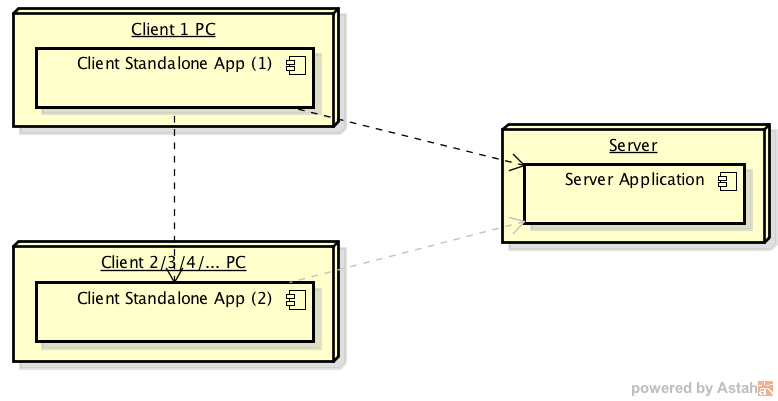
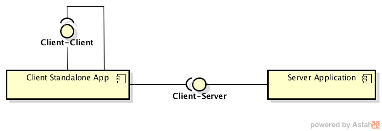
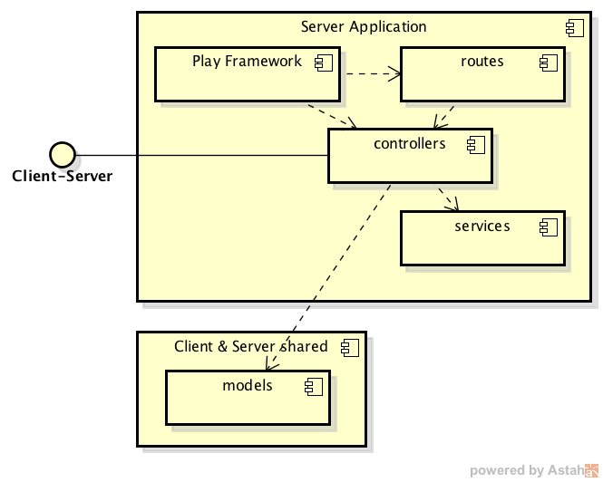
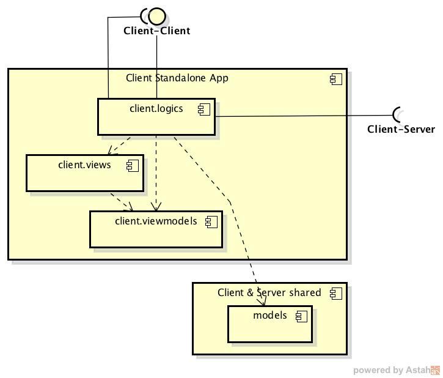
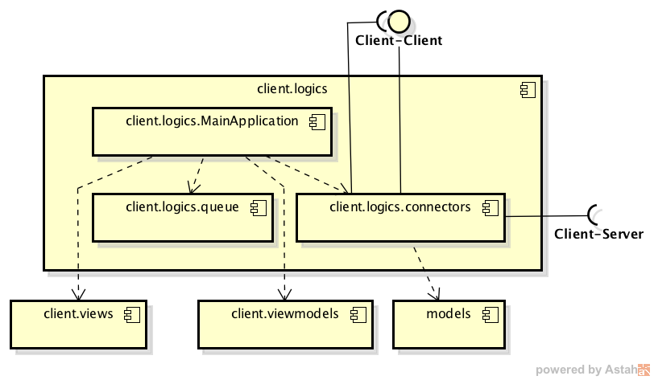

Backupper
=========

arc42, das Template zur Dokumentation von Software- und
Systemarchitekturen.

Erstellt von Dr. Gernot Starke, Dr. Peter Hruschka und Mitwirkenden.

Template Revision: 7.0 DE (asciidoc-based), January 2017

© We acknowledge that this document uses material from the arc 42
architecture template, <http://www.arc42.de>. Created by Dr. Peter
Hruschka & Dr. Gernot Starke.

Einführung und Ziele
====================
Backupper ist eine Software, mit welcher Endanwender auf eine einfache Weise **Backups** auf den Computer von **Freunden** erstellen können.

Aufgabenstellung
----------------
Backupper archiviert einen oder mehrere Ordner von einem Computer zu jenem eines Freundes über das Internet.
In einer ersten Version werden folgende Features unterstützt:
1. TODO [Task #16](https://github.com/1tchy/bakupper/issues/16) ( Define features for first, simple version)

Qualitätsziele
--------------
Nach [ISO/IEC 9126](https://de.wikipedia.org/wiki/ISO/IEC_9126):

| Priorität | Qualitäts-Ziel | Szenario |
|----------:|----------------|----------|
| 1 | Funktionalität / Richtigkeit | Archivierte Dateien werden so gespeichert, dass sie auch wieder wiederhergestellt werden können
| 2 | Funktionalität / Sicherheit | Es können nur die berechtigte Nutzer auf die Backup-Daten zugreifen
| 3 | Benutzbarkeit / Erlernbarkeit | Die Software soll so einfach geschrieben werden, dass sie auch von einer wenig computerversierten Person ohne Studieren der Anleitung verwendet werden kann
| 3 | Übertragbarkeit / Installierbarkeit | Die Software soll so einfach installiert werden können, dass sie auch von einer wenig computerversierten Person ohne Studieren der Anleitung installiert werden kann
| 4 | Benutzbarkeit / Attraktivität | Eine Umfrage soll ergeben, dass mindestens 80% der Nutzer die Software als "attraktiv" bezeichnen
| 5 | Zuverlässigkeit / Reife | Die Software soll dem Benutzer das einwandfreie Funktionieren oder auftretende Fehler anzeigen
| 6 | Funktionalität / Interoperabilität | Die Software soll auf mindestens auf Windows und Mac laufen
| 7 | Änderbarkeit / Analysierbarkeit, Modifizierbarkeit, Testbarkeit| Der Code der Software soll qualitativ hochwertig sein.

Stakeholder
-----------

| Person/Rolle | Kontakt | Erwartungshaltung |
|--------------|---------|-------------------|
| Laurin | | Software entwickeln, Software selber nutzen können, Spass bei der Entwicklung haben, evtl. Geld mit Software verdienen
| Daniela | | TODO

Randbedingungen
===============
Backupper soll:
- einfach Bedienbar sein
- auf Windows und Mac laufen

Kontextabgrenzung
=================

Fachlicher Kontext
------------------

#### User & Friend

Zwei Benutzer der Applikation, welche gegenseitig oder auch nur von Einem zum Anderen ihre Daten backuppen.
Sie haben beide die (gleiche) Client Standalone App installiert.

#### Client Standalone App

Unsere Applikation mit einem GUI für den Benutzer.
Sie baut Verbindungen auf zu anderen Benutzern (Client-Client) und zum Server (Client-Server).

#### Server Application

Zentrale Server Applikation, welche zwischen den Clients vermittelt.

Technischer Kontext
-------------------

Lösungsstrategie
================

Bausteinsicht
=============

Whitebox Gesamtsystem
---------------------

| Baustein/Schnittstelle | Beschreibung |
|------------------------|--------------|
| Client Standalone App | Standalone-Applikation
| Server Applikation | Auf dem [Play Framework](https://www.playframework.com/) basierter Teil.
| Client-Client | Verbindung zwischen den Clients, über welche die Daten archiviert wird.
| Client-Server | [REST](https://de.wikipedia.org/wiki/Representational_State_Transfer)-Schnittstelle zwischen Client und Server, über welcher das Backup koordiniert wird.

### Server Application

| Baustein/Schnittstelle | Beschreibung |
|------------------------|--------------|
| Client-Server | Wird durch das Packet `interfaces` definiert und durch `controllers.implementations` implementiert
| [Play Framework](https://www.playframework.com/) |
| routes | Datei unter `conf/routes`, welche vom Play Framework verwendet wird um die HTTP-Requests auf die Controller zu mappen
| controllers | Enthält den Haupt-Controller (`controllers.BaseApiController`), welcher vom Play Framework aufgerufen wird und die Aufrufe auf die Implementationen (`controllers.implementations.*`) delegiert
| services | Hilfsklassen für den Server, enthalten den Grossteil der Business-Logik vom Server
| models | Modell-Klassen, welche mit dem Client geteilt werden

### Client Standalone App

| Baustein/Schnittstelle | Beschreibung |
|------------------------|--------------|
| Client-Client | siehe [client.logics](#clientlogics)
| Client-Server | siehe [client.logics](#clientlogics)
| client.logics | Enthält den zentralene Code des Clients  und damit den Grossteil dessen Business-Logik
| client.views | Enthält die Definitionen und Ressourcen des GUIs
| client.viewmodels | Enthält die View-spezifischen Modelle nach dem [MVVM-Pattern](https://de.wikipedia.org/wiki/Model_View_ViewModel).
| models | Modell-Klassen, welche mit dem Server geteilt werden

#### client.logics

| Baustein/Schnittstelle | Beschreibung |
|------------------------|--------------|
| Client-Client | Wird durch das Paket `client.logic.connectors.client` definiert, implementiert und genutzt
| Client-Server | Wird durch das Paket `interfaces` definiert und durch `client.logic.connectors.server.implementations` genutzt
| client.logics.MainApplication | Einstiegspunkt in die Software, lädt das GUI und den Rest der Standalone Client Applikation
| client.logics.queue | Implementation eines Queue-Mechanismuses, mit welchem die Applikation entkoppelt wird. Nach dem Injecten des `QueueAccessors` können an diesen verschiedene `Command`s übergeben werden, welche dann je nach verwendeter Ressource (CPU, Disk, Network) in einem entsprechenden Thread(Pool) abgearbeiter werden
| client.logics.connectors | Implementiert Connectoren um auf die Client-Client und Client-Server Schnittstellen zuzugreifen

Laufzeitsicht
=============

Verteilungssicht
================

Querschnittliche Konzepte
=========================

Entwurfsentscheidungen
======================

| Nummer | Entscheid | evaluierte Alternativen | Begründung | Datum | Entscheid durch |
|-------:|-----------|-------------------------|------------|:-----:|-----------------|
| 1 |

Qualitätsanforderungen
======================

Qualitätsbaum
-------------

Qualitätsszenarien
------------------

Risiken und technische Schulden
===============================

Glossar
=======

| Begriff | Definition |
|---------|------------|
